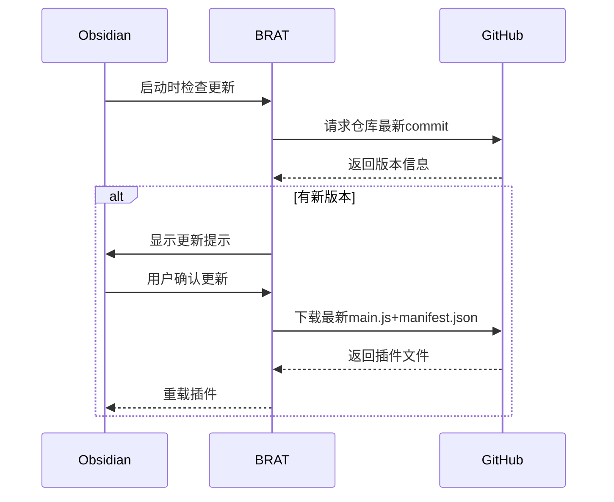

## 简介
$Beta Reviewers Auto-update Tool$，简称$BRAT$是一个专为开发者和插件/主题测试人员设计的插件，可以轻松安装测试版插件。通过将$GitHub$存储库路径添加到测试列表中，即可轻松检查更新，下载并重新加载插件，省去了手动创建文件夹、下载文件、复制到正确位置等繁琐步骤。该插件简化了测试过程，解决了开发者和测试人员的繁重工作，提高了工作效率。
总而言之：$BRAT$可实现快速获取未发布到官方插件商店的新插件（如开发者自测版本、社区实验性插件等）。
### 核心功能
|功能|说明|适用场景|
|---|---|---|
|**URL直装**|通过GitHub仓库地址直接安装插件|开发者调试、用户尝鲜新功能|
|**自动更新**|检测GitHub仓库的更新并提示升级|实时获取最新修复/功能|
|**版本回退**|可选恢复到历史版本|测试版本出现严重bug时|
|**安全扫描**|安装时自动校验仓库合法性|防止恶意代码注入|
## 安装
设置->第三方插件->社区插件市场->浏览->搜索 "BRAT"->安装并启用
## 使用
1. 快捷键`Ctrl + P`，打开命令面板。
2. 输入`BRAT:Plugins: Add a beta plugin for testing`
3. 输入要测试的插件GitHub仓库URL（格式如：`https://github.com/user/repo`），选择`Add Plugin`添加插件。
## 实现原理

## 与同类方案对比
|          | BRAT        | 手动安装ZIP    | 发布社区版    |
| -------- | ----------- | ---------- | -------- |
| **更新效率** | ✅ 自动        | ❌ 需重复下载    | ✅ 官方自动更新 |
| **分发范围** | 🔗 精准控制测试人员 | 📧 文件传输    | 🌍 全社区可见 |
| **审核要求** | ❌ 无需审核      | ❌ 无        | ✅ 需官方审核  |
| **调试支持** | 🔧 支持回退版本   | 🛠️ 无法追溯历史 | ⏳ 仅正式版本  |
