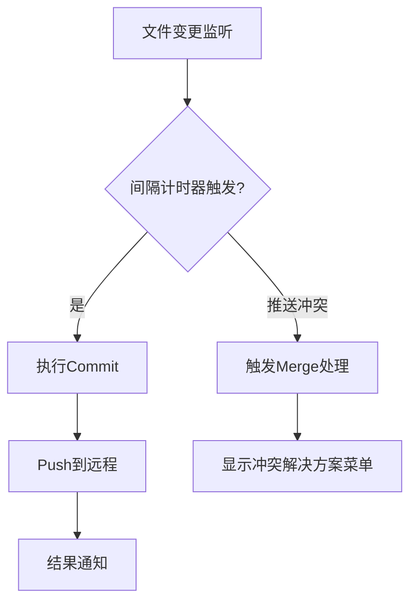

## 简介
$Obsidian-Git$是一款专为$Obsidian$设计的$Git$版本控制自动化插件。
### 核心功能
| 功能 | 实现方式 | 典型场景 |
| ---------- | ------------------------------ | ------------- |
| **自动备份** | 定时执行`git add + commit + push` | 防止意外数据丢失|
| **跨设备同步** | 基于Git云端仓库 (GitHub/Gitee等) | 多终端同步工作进度 |
| **版本时光机** | 可视化查看历史修改记录 | 误删恢复/版本对比 |
| **冲突解决方案** | 本地副本优先/远程优先选择器 | 多设备同时修改时的智能合并 |
| **差分对比** | 内置差异查看器 (side-by-side diff) | 直观查看内容变动 |
## 安装
1. 设置->第三方插件->社区插件市场->浏览->搜索 "Git"->安装并启用
2. 快捷键`Ctrl + P`，打开命令面板->输入`BRAT:Plugins: Add a beta plugin for testing`->输入GitHub仓库URL`https://github.com/Vinzent03/obsidian-git`，选择`Add Plugin`添加插件。
## 使用
### 前提准备（之前有过`git`命令行操作可无视）
1. 安装 Git 客户端
2. 创建空的 GitHub仓库
3. 在 Obsidian 库根目录初始化Git：`git init && git remote add origin <仓库URL>`
### 打开版本控制视图
快捷键`Ctrl + P`，打开命令面板->输入`Git: Open source control view`->右侧边栏出现
#### `Commit-and-sync`（提交和同步）
默认设置下，这将提交所有更改、拉取并推送。
#### `Commit Message`（提交信息）
Git 版本控制系统中，用文字描述代码/文件变更的说明信息。作用是让每次代码修改的目的和内容可追溯。
##### 默认自动提交信息模版
```
vault backup: {{date}}
```
含义：提交时的日期
#### `Changes`（列出更改的文件）
例如点击这里的`Obsidian-Git`可查看此文件的差异视图右侧视图可修改，影响源文件。
## 操作流程
1. 编辑文件
2. 填写`Commit Message`字段
3. 点击`Commit-and-sync`按钮，提交更改。
## 实现原理
